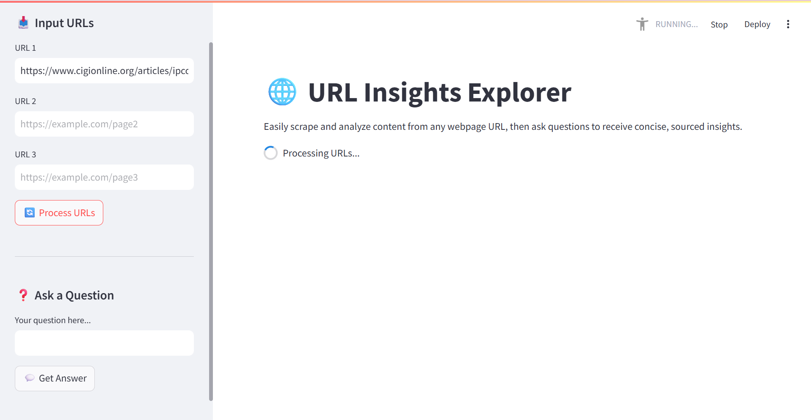
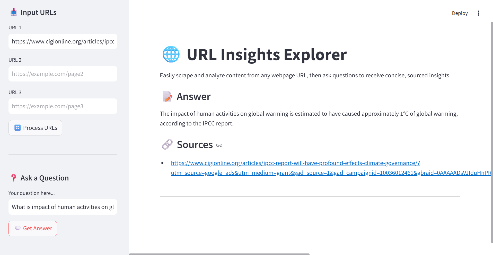

# url\_insights\_explorer

A Streamlit application that uses Retrieval-Augmented Generation (RAG) to extract and explore insights from web pages.

---

## 🚀 Features

* **Simple two-step workflow**: 1) Scrape and index URLs, then 2) Ask questions to retrieve context-rich answers.
* **Dynamic content handling** via Selenium for robust scraping.
* **Efficient text splitting** using overlapping chunks for better embedding coverage.
* **Persistent vector store** powered by Chroma for fast, local retrieval.
* **Groq LLM integration** for generating high-quality answers with source citations.

---

## 🛠️ Installation

1. **Clone the repository**:

   ```bash
   git clone git@github.com:SomeshJoshi-96/url_insights_explorer.git
   cd url_insights_explorer
   ```

2. **Create a `.env` file** in the project root:

   ```dotenv
   # .env
   GROQ_API_KEY=<your-groq-api-key>
   ```

3. **Install dependencies**:

   ```bash
   pip install -r requirements.txt
   ```

4. **Install a Selenium driver** (e.g., ChromeDriver) and ensure it’s on your PATH.

---

## ⚙️ Configuration

* **Chunk size & overlap**: Adjust in `rag.py` via `RecursiveCharacterTextSplitter(chunk_size, chunk_overlap)`.
* **Model parameters**: Set model name and parameters in `initialize_components()` within `rag.py`.
* **Vector store location**: Default path is `resources/vectorstore/`; modify as needed.

---

## 🏃 Usage

1. **Start the app**:

   ```bash
   streamlit run main.py
   ```

2. **Process URLs**:

   * Enter one or more URLs in the sidebar and click **Process URLs**.
   * Monitor the progress messages until indexing completes.

3. **Ask questions**:

   * Type your query under **Your Question** in the sidebar and click **Get Answer**.
   * View the answer and linked source URLs in the main panel.

---

## 📸 Screenshots

> *Include screenshots in the `docs/screenshots/` folder and reference them below.*

```markdown



```

---

## 🤝 Contributing

Contributions welcome! Please:

* Open issues for bugs or feature requests
* Submit pull requests with enhancements or fixes

---

## 📄 License

Distributed under the MIT License. See [LICENSE](LICENSE) for details.
